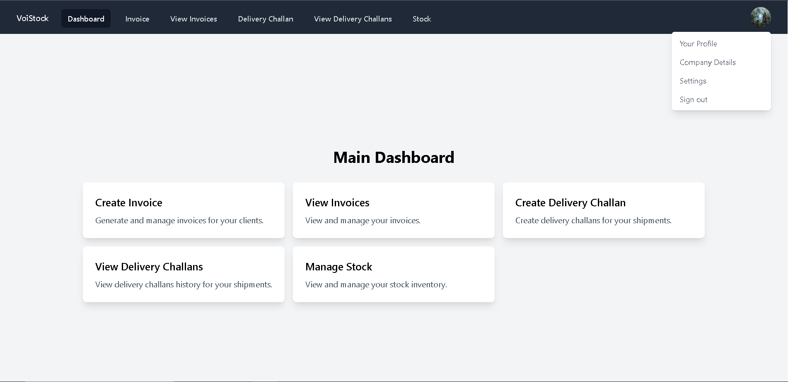

# VoiStock — Professional Invoicing & Stock Management

VoiStock is a production-grade invoicing and stock-management frontend I use professionally. It provides a focused UI for creating invoices, managing delivery challans, and tracking stock. The frontend is built with modern web tooling for fast iteration and a polished UX.

Quick overview

- Stack: React 19 + TypeScript, Vite, Tailwind CSS.
- Features: user auth, profiles, company details, invoice creation, delivery challans, stock dashboard, print/export.
- Designed for: small businesses, freelancers, and internal teams needing a simple invoicing workflow.

Getting started (developer)

1. Clone the repository:

	git clone https://github.com/Karan-Jaswani/VoiStockFrontend.git
	cd VoiStockFrontend

2. Create your local env file from the example and set the backend URL:

	cp .env.example .env.local

	Edit .env.local and set `VITE_VOISTOCK_API_URL`

3. Install and run:

	npm install
	npm run dev

Open http://localhost:5173 to use the app.


## Table of contents

- [Demo / Screenshot](#demo--screenshot)
- [Feature tour](#feature-tour)
- [Quick start](#getting-started-developer)
- [API examples](#api-examples)
- [Troubleshooting](#troubleshooting)
- [Contribute & contact](#contribute--contact)

## Demo / Screenshot

Below is a quick visual of the main dashboard. This is a screenshot mock to give visitors a preview of the UI.



## Feature tour

This project contains the frontend features I rely on daily:

- Authentication and session management (JWT stored in session storage).
- Company profile with bank details used for invoice templates and payment fields.
- Create, print, and export invoices (A4-ready print styling included).
- Delivery challan creation and printing.
- Stock dashboard showing current inventory, quantities and quick updates.
- Search and lists for invoices and delivery challans with pagination.

## API examples

The frontend communicates with a backend API. Set `VITE_VOISTOCK_API_URL` in your `.env.local` to point to your backend.

Example: fetch stocks for a user

```bash
curl -X GET "${VITE_VOISTOCK_API_URL}/api/stocks/:userId" \
	-H "Accept: application/json"
```

Example: submit an invoice

```bash
curl -X POST "${VITE_VOISTOCK_API_URL}/api/invoice" \
	-H "Content-Type: application/json" \
	-d '{ "invoice": { "invoiceNo": "INV-001", "clientName": "Acme" }, "stockUpdates": [] }'
```

These are examples only — check your backend's API docs for exact field names and auth requirements.

## Troubleshooting

If you hit issues when running the project locally, try these quick checks:

- White page / runtime error referencing `process` — Ensure you use Vite env vars (`VITE_...`) and restart the dev server.
- Tailwind styles not applying — run `npm install` to ensure `postcss` and `autoprefixer` are installed, then restart the dev server.
- Backend CORS errors — enable appropriate CORS headers on the backend for your dev origin (http://localhost:5173).
- Missing logo or assets — place static images in `public/` and reference them with absolute paths (`/VoiStock_Logo.png`).

## Contribute & contact

- This frontend is used professionally. If you'd like to reuse code, please reach out on LinkedIn so we can discuss licensing and collaboration.
- For bug reports or feature requests, open an issue on this repository.


## Thank You!